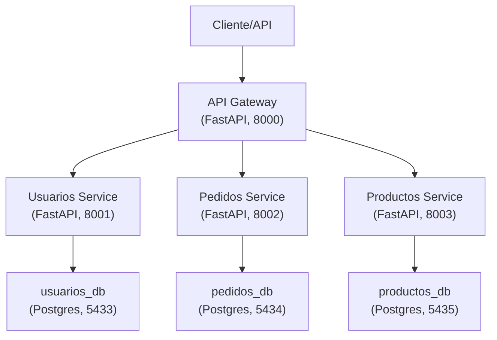

# poc_strangler_application_ms
Subtemas clave para la presentación G2, para la estrategias de modelado y granularidad de microservicios
# PoC: Strangler Application Pattern con Microservicios en FastAPI

## 1. Introducción al Patrón Strangler Application

El patrón **Strangler Application** permite modernizar aplicaciones monolíticas migrando funcionalidades de forma incremental a microservicios, sin interrumpir el negocio.  
Se empieza integrando una capa de “estrangulamiento” (por ejemplo, un API Gateway), que enruta solicitudes tanto al monolito legacy como a los nuevos microservicios, hasta reemplazar por completo el sistema antiguo.

---

## 2. Errores Comunes al Definir el Tamaño de los Microservicios

- **Microservicios demasiado pequeños:**  
  Provoca un exceso de servicios, complejidad operativa, alta latencia y dificultad en la gestión.

- **Microservicios demasiado grandes (“mini-monolitos”):**  
  No resuelven los problemas del legacy y generan dependencias innecesarias.

- **No alinear límites de servicio a dominios de negocio:**  
  Los microservicios deben mapearse a *bounded contexts* reales del negocio, no solo a modelos de datos.

- **Compartir bases de datos entre servicios:**  
  Cada microservicio debe tener su propia base de datos (como en esta PoC), para evitar acoplamientos.

---

## 3. Explicación del Funcionamiento del Patrón Strangler Application

1. **Monolito en producción:**  
   El sistema legacy maneja todas las operaciones.

2. **API Gateway como orquestador:**  
   El API Gateway enruta peticiones. Inicialmente dirige todo al monolito.

3. **Migración progresiva:**  
   Se crean microservicios independientes (ejemplo: usuarios, pedidos, productos), cada uno con su propia base de datos PostgreSQL.

4. **Redirección selectiva:**  
   El API Gateway empieza a enviar ciertas rutas al microservicio nuevo en vez del monolito.

5. **Desacople total:**  
   Progresivamente, todas las funcionalidades migran; cuando el monolito deja de recibir tráfico, se elimina.

---

## Descripción
Prueba de Concepto que implementa el patrón Strangler Application, migrando de un monolito a microservicios con FastAPI y PostgreSQL. El API Gateway orquesta el tráfico a los servicios: Usuarios, Pedidos y Productos.

## Arquitectura

- **API Gateway**: FastAPI, enruta peticiones a los microservicios.
- **Microservicios**: FastAPI + PostgreSQL (uno por dominio: usuarios, pedidos, productos).
- **Contenedores**: Todo orquestado localmente con Docker Compose.

## Estructura del Proyecto

```text
poc_strangler_application_ms/
│
├── api_gateway/
│   ├── main.py
│   └── Dockerfile
│
├── usuarios_service/
│   ├── main.py
│   └── Dockerfile
│
├── pedidos_service/
│   ├── main.py
│   └── Dockerfile
│
├── productos_service/
│   ├── main.py
│   └── Dockerfile
│
├── docker-compose.yml
│
└── README.md
```



## Levantamiento de la solución

1. Clona el repo:
    ```bash
    git clone https://github.com/anfedimo/poc_strangler_application_ms.git
    cd poc_strangler_application_ms
    ```
2. Construye y levanta los contenedores y reiniciar si hay cambios:
    ```bash
    docker-compose up --build
   # O si ya está levantado y quieres reiniciar:
    docker-compose down
    docker-compose build
    docker-compose up
    ```
3. Endpoints disponibles:
    - API Gateway: [http://localhost:8000](http://localhost:8000)
    - Usuarios: [http://localhost:8001/usuarios](http://localhost:8001/usuarios)
    - Pedidos: [http://localhost:8002/pedidos](http://localhost:8002/pedidos)
    - Productos: [http://localhost:8003/productos](http://localhost:8003/productos)

   También puedes probar vía gateway:
    - [http://localhost:8000/usuarios](http://localhost:8000/usuarios)
    - [http://localhost:8000/pedidos](http://localhost:8000/pedidos)
    - [http://localhost:8000/productos](http://localhost:8000/productos)

## Observaciones

- Cada microservicio tiene su propia base de datos PostgreSQL.
- Puedes extender la lógica agregando modelos y rutas.
- Ideal para demostrar migración progresiva usando el patrón Strangler Application.

---

**DevOps Ready:** Sigue las mejores prácticas de separación de servicios, independencia de base de datos y despliegue por contenedores.

---
Arquitectura de Software — Universidad de La Sabana — Grupo 14 — 2025